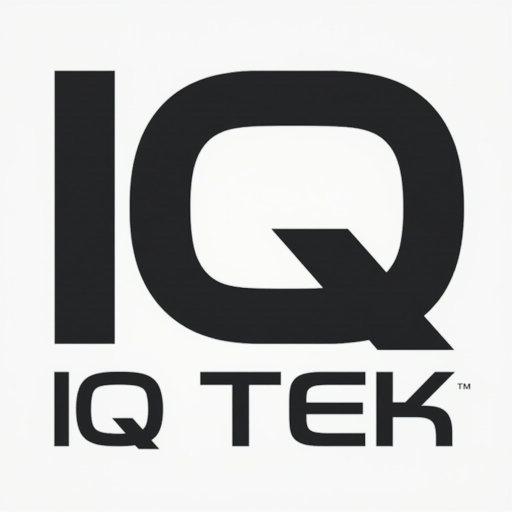

# IQ-Tek Website



## 🚀 Acerca del Proyecto

Sitio web corporativo moderno y profesional para IQ-Tek, una marca especializada en el desarrollo de aplicaciones móviles innovadoras, seguras y eficientes que priorizan la privacidad del usuario.

### ✨ Características Principales

- **🎨 Diseño Moderno**: Interface con dark mode, glassmorphism y efectos neon
- **📱 Totalmente Responsive**: Optimizado para todos los dispositivos
- **✨ Animaciones Avanzadas**: Loading screens, partículas, parallax y efectos ripple
- **♿ Accesible**: Cumple con estándares WCAG 2.1
- **🔧 Modular**: Arquitectura CSS escalable y mantenible
- **⚡ Optimizado**: Carga rápida y performance optimizada
- **🔍 SEO Friendly**: Meta tags optimizados y estructura semántica
- **🌟 Efectos Visuales**: Terminal animado, elementos flotantes y transiciones suaves

## 🏗️ Estructura del Proyecto

```
IQ-Tek.github.io/
├── 📄 index.html              # Página principal
├── 📄 README.md               # Este archivo
├── 📄 google56a633adce28275f.html  # Verificación Google
├── 📁 assets/
│   └── 📁 images/
│       ├── 🖼️ favicon.ico     # Icono del sitio
│       ├── 🖼️ IQTek.jpg       # Logo principal
│       ├── 🖼️ IQTek512.jpg    # Logo alta resolución
│       └── 🖼️ portada.jpg     # Imagen de portada
├── 📁 css/
│   ├── 🎨 styles.css          # Estilos principales (dark mode, glassmorphism)
│   └── 🎨 politica.css        # Estilos específicos de política
├── 📁 js/
│   ├── ⚙️ main.js             # Funcionalidad principal
│   ├── ⚙️ acordion.js         # Componente acordeón
│   └── ✨ effects.js          # Efectos visuales y animaciones
└── 📁 pages/
    └── 📄 politica-passwallet.html  # Política de privacidad
```

## 🎨 Sistema de Diseño

### Tema Dark Mode y Glassmorphism

```css
/* Colores Dark Mode */
--bg-primary: #0a0a0f        /* Fondo principal */
--bg-secondary: #1a1a2e      /* Fondo secundario */
--text-primary: #ffffff      /* Texto principal */
--text-secondary: #a1a1aa    /* Texto secundario */
--glass-bg: rgba(255, 255, 255, 0.05)  /* Glassmorphism */
--glass-border: rgba(255, 255, 255, 0.1)

/* Colores Neon */
--neon-blue: #00d9ff         /* Azul neon */
--neon-purple: #9333ea       /* Púrpura neon */
--neon-orange: #ff6b35       /* Naranja neon */
--neon-green: #10b981        /* Verde neon */
--success-color: #10b981    /* Verde éxito */
--warning-color: #f59e0b    /* Amarillo advertencia */
--error-color: #ef4444      /* Rojo error */
```

### Tipografía

- **Fuente Principal**: Inter (Google Fonts) - Interface moderna
- **Fuente Código**: JetBrains Mono - Terminal y código
- **Fallback**: System fonts (-apple-system, BlinkMacSystemFont, 'Segoe UI', 'Roboto')
- **Escalas**: text-xs (0.75rem) hasta text-6xl (3.75rem)

### Efectos y Animaciones

```css
/* Glassmorphism */
.glass {
  background: rgba(255, 255, 255, 0.05);
  backdrop-filter: blur(10px);
  border: 1px solid rgba(255, 255, 255, 0.1);
}

/* Efectos Neon */
.glow {
  box-shadow: 0 0 20px var(--neon-blue);
  text-shadow: 0 0 10px currentColor;
}

/* Animaciones */
.fade-in-up { animation: fadeInUp 0.6s ease-out; }
.pulse { animation: pulse 2s infinite; }
.ripple { animation: ripple 0.6s ease-out; }
```

### Espaciado

Sistema basado en múltiplos de 0.25rem (4px):
- `--space-1`: 0.25rem (4px)
- `--space-4`: 1rem (16px)
- `--space-8`: 2rem (32px)
- `--space-16`: 4rem (64px)

## 🛠️ Tecnologías Utilizadas

- **HTML5**: Estructura semántica moderna
- **CSS3**: Custom Properties, Glassmorphism, Dark Mode
- **JavaScript ES6+**: Clases modernas, módulos, efectos visuales
- **Google Fonts**: Tipografía Inter + JetBrains Mono
- **Intersection Observer API**: Animaciones en scroll
- **CSS Grid & Flexbox**: Layout responsive
- **Canvas API**: Efectos de partículas y animaciones
- **Web Animations API**: Transiciones suaves y efectos

## 📱 Aplicaciones

### Pass Wallet 🔐

**[📱 Descargar en Google Play](https://play.google.com/store/apps/details?id=com.iqtek.pass_wallet&pcampaignid=web_share)**

Aplicación de almacenamiento seguro que permite guardar:
- Contraseñas
- Usuarios
- Números de tarjetas
- Datos sensibles

**Características de Seguridad:**
- 🔒 Cifrado AES-256 de grado militar
- 🔑 Claves criptográficas únicas por cada dato
- 🛡️ Algoritmos estándar de la industria
- 📱 Almacenamiento 100% local sin conexión a servidores
- 🚫 Sin seguimiento ni publicidad
- 🔐 Arquitectura zero-knowledge para privacidad total

**Estándares de Seguridad:**
- **FIPS 140-2:** Algoritmos aprobados por instituciones gubernamentales
- **Zero-Knowledge:** Arquitectura que garantiza privacidad total
- **ISO/IEC 18033:** Estándares internacionales de cifrado
- **AES-256:** Cifrado reconocido mundialmente por instituciones financieras

## 🚀 Instalación y Desarrollo

### Pre-requisitos
- Navegador web moderno
- Servidor local (opcional para desarrollo)

### Desarrollo Local

1. **Clonar el repositorio**
   ```bash
   git clone https://github.com/IQ-Tek/IQ-Tek.github.io.git
   cd IQ-Tek.github.io
   ```

2. **Servir localmente** (opcional)
   ```bash
   # Con Python
   python -m http.server 8000
   
   # Con Node.js (http-server)
   npx http-server
   
   # Con PHP
   php -S localhost:8000
   ```

3. **Abrir en navegador**
   ```
   http://localhost:8000
   ```

## 🧩 Componentes Modulares

### Botones
```html
<a href="#" class="btn btn--primary">Primario</a>
<a href="#" class="btn btn--secondary">Secundario</a>
<a href="#" class="btn btn--outline">Outline</a>
```

### Cards
```html
<div class="card">
  <div class="card__header">
    <h3 class="card__title">Título</h3>
  </div>
  <p class="card__description">Descripción</p>
</div>
```

### Acordeón
```html
<div class="accordion__item">
  <button class="accordion__toggle" aria-expanded="false" aria-controls="content-id">
    <span>Título</span>
    <span class="accordion__icon">▼</span>
  </button>
  <div class="accordion__content" id="content-id">
    <!-- Contenido -->
  </div>
</div>
```

## 🎯 Características Técnicas

### Performance
- ⚡ Carga optimizada de fuentes y recursos
- 🖼️ Imágenes optimizadas y lazy loading
- 📦 CSS y JS optimizados
- 🚀 Animaciones con hardware acceleration
- ✨ Efectos visuales optimizados para 60fps

### Efectos Visuales Avanzados
- 🌟 Loading animation con spinner personalizado
- 📊 Indicador de progreso de scroll
- ✨ Partículas flotantes dinámicas
- 💧 Efectos ripple en interacciones
- �️ Terminal animado en tiempo real
- 🌊 Parallax suave en elementos
- 🎯 Intersection Observer para animaciones

### SEO
- 📊 Meta tags optimizados
- 🔗 Open Graph y Twitter Cards
- 📱 Responsive meta viewport
- 🏷️ Structured data ready

### Accesibilidad
- ♿ Soporte completo de teclado
- 🎯 ARIA labels y roles
- 📖 Skip links para navegación
- 🎨 Alto contraste compatible
- 🔊 Screen reader friendly

### Responsive Design
- 📱 Mobile First approach
- 🖥️ Breakpoints: 640px, 768px, 1024px
- 📏 Fluid typography y spacing
- 🔄 Touch-friendly interface

## 🔧 Personalización

### Agregar Nueva App

1. **Actualizar HTML** en `index.html`:
```html
<div class="app-card card">
  <div class="card__header">
    <div class="app-card__badge">
      <span>🎯</span>
      <span>Nueva App</span>
    </div>
    <h3 class="card__title">Nombre de la App</h3>
  </div>
  <!-- Contenido de la app -->
</div>
```

2. **Crear página de política** (si aplica):
```bash
cp pages/politica-passwallet.html pages/politica-nuevaapp.html
```

### Modificar Colores

Editar variables CSS en `css/styles.css`:
```css
:root {
  --primary-color: #tu-color;
  --accent-color: #tu-acento;
}
```

### Añadir Componente

1. **CSS** en `css/styles.css`
2. **JavaScript** en `js/main.js`
3. **Documentar** en este README

## 📊 Analytics y Tracking

El sitio incluye un sistema de analytics básico que registra:
- 👀 Vistas de página
- 🖱️ Clics en botones
- 📂 Interacciones con acordeón
- ⏱️ Tiempo de carga

Para habilitar analytics externos, integrar en `js/main.js`.

## 🔒 Privacidad y Seguridad

- ✅ Sin cookies de tracking
- ✅ Sin scripts de terceros innecesarios
- ✅ HTTPS ready
- ✅ CSP headers compatibles
- ✅ Política de privacidad completa

## 🚀 Despliegue

### GitHub Pages (Automático)
```bash
git push origin main
# El sitio se actualizará automáticamente en https://iq-tek.github.io
```

### Otro Hosting
1. Subir todos los archivos al servidor
2. Configurar dominio (opcional)
3. Habilitar HTTPS
4. Configurar headers de seguridad

## 🤝 Contribución

1. Fork el proyecto
2. Crear feature branch (`git checkout -b feature/nueva-caracteristica`)
3. Commit cambios (`git commit -m 'Agregar nueva característica'`)
4. Push a la rama (`git push origin feature/nueva-caracteristica`)
5. Abrir Pull Request

## 📞 Contacto

- 📧 **Email**: [contacto.iqtek@gmail.com](mailto:contacto.iqtek@gmail.com)
- 🌐 **Website**: [https://iq-tek.github.io](https://iq-tek.github.io)
- 📱 **Apps**: Google Play Store

## 📄 Licencia

© 2025 IQ-Tek. Todos los derechos reservados.

---

*Desarrollado con ❤️ por IQ-Tek - Aplicaciones móviles innovadoras y seguras*